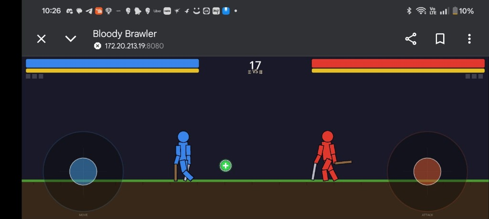
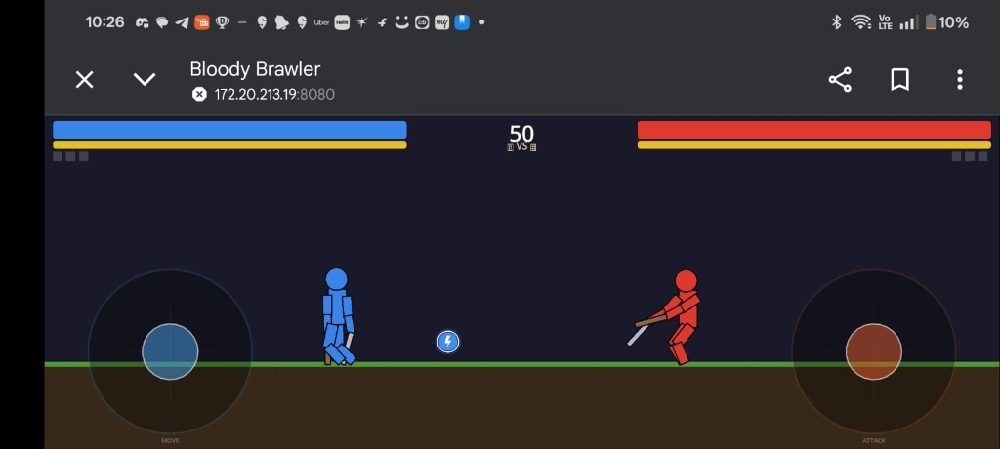
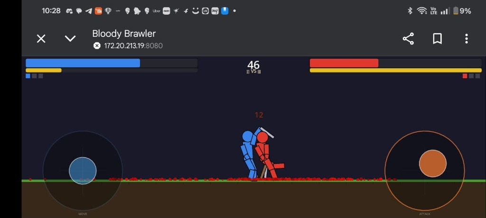
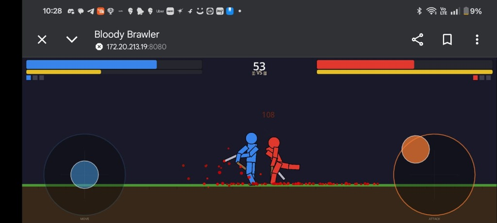
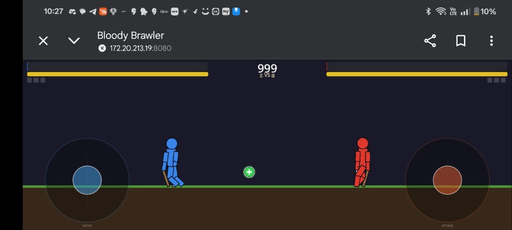

# ⚔️ Bloody Brawler

> **A real-time online PvP ragdoll fighting game built with Godot 4 + Node.js WebSocket server.**

Two players battle it out in a physics-based brawl — swing weapons, manage stamina, grab power-ups, and survive! Features a host-authoritative multiplayer model with role-locked visuals and a Best-of-3 round system with Sudden Death.

---

## 🎮 Screenshots

### Gameplay
| Arena Overview | Power-ups |
|:-:|:-:|
|  |  |

### Combat
| Close Combat | Heavy Hit (108 DMG!) |
|:-:|:-:|
|  |  |

### Sudden Death
| Equal HP → Both drop to 1 HP! |
|:-:|
|  |

---

## ✨ Features

### Combat
- **Physics-based ragdoll fighters** — fully simulated bodies, limbs, and weapons
- **Dual weapon system** — sword (right hand) and shield (left hand)
- **Stamina management** — attacks cost stamina (15 per swing), regens at 150/sec
- **Damage zones** — headshots deal 2.5×, body 1.2×, limbs 0.6×
- **Visual effects** — blood splatter, screen shake, damage numbers, hit flashes

### Multiplayer
- **Real-time online PvP** via WebSocket (WSS)
- **Host-authoritative architecture** — prevents cheating
- **Room system** — create/join with 6-digit room codes
- **Role-locked visuals** — you're always Blue (left), opponent always Red (right)
- **20Hz snapshot sync** with client-side interpolation + position correction
- **Mobile + PC cross-play** via web export

### Game Modes
- **Best of 3 rounds** with persistent scores
- **60-second round timer** with 10-second warning
- **⚡ Sudden Death** — equal HP at timer expiry → both drop to 1 HP, first hit wins!
- **Power-ups** — Health (green +) and Speed (blue ⚡) pickups, host-authoritative with role-relative positioning

### UI/UX
- **Large, mobile-friendly UI** — 72px title, large touch targets
- **Touch joysticks** — move (left) and attack (right), doubled size for easy control
- **Responsive HUD** — HP/stamina bars scale with screen, round indicators, timer
- **Dark premium theme** with red accents and blood decor

---

## 🛠️ Tech Stack

| Component | Technology |
|-----------|-----------|
| **Game Engine** | Godot 4.x (GDScript) |
| **Server** | Node.js + `ws` (WebSocket) |
| **Networking** | WSS (secure WebSocket) |
| **Certificates** | Self-signed via `selfsigned` npm package |
| **Export** | Web (HTML5) for cross-platform play |

---

## 🚀 Getting Started

### Prerequisites
- [Godot 4.x](https://godotengine.org/download)
- [Node.js](https://nodejs.org/) (v18+)

### 1. Clone the Repository
```bash
git clone https://github.com/nikhilmekala-coder/bloody-brawlers.git
cd bloody-brawlers
```

### 2. Start the Server
```bash
cd server
npm install
node server.js
```
The server starts on `https://localhost:8080` with auto-generated SSL certificates.

### 3. Run the Game
- Open `project.godot` in Godot 4
- Press **F5** to run
- Or export to **Web (HTML5)** and open via the server URL

### 4. Play Multiplayer
1. **Player 1**: Click "CREATE PARTY" → share the 6-digit room code
2. **Player 2**: Click "JOIN PARTY" → enter the code
3. **Player 1**: Click "START GAME"

### 📱 Mobile Play
Access the server URL (e.g., `https://192.168.x.x:8080`) on your phone's browser. Accept the self-signed certificate warning, then create/join a room!

---

## 🎯 Controls

### Keyboard (PC)
| Key | Action |
|-----|--------|
| A / D | Move left / right |
| Arrow Keys | Swing weapon in direction |

### Touch (Mobile)
| Joystick | Action |
|----------|--------|
| Left joystick | Move |
| Right joystick | Swing / Attack (flick to strike) |

---

## 📁 Project Structure

```
bloddy-brawler/
├── project.godot          # Godot project config
├── main.tscn              # Main game scene
├── main_menu.tscn         # Menu scene
├── scripts/
│   ├── game_manager.gd    # Core game loop, HUD, rounds, networking
│   ├── fighter.gd         # Ragdoll fighter physics + combat
│   ├── main_menu.gd       # Lobby UI + room management
│   ├── network_manager.gd # WebSocket client (autoload)
│   ├── power_up.gd        # Collectable power-ups
│   ├── power_up_spawner.gd# Host-authoritative spawning
│   ├── effects_manager.gd # Blood, shake, damage numbers
│   ├── virtual_joystick.gd# Touch joystick controls
│   └── sound_manager.gd   # Audio manager (autoload)
├── server/
│   ├── server.js          # Node.js WebSocket relay server
│   └── package.json       # Server dependencies
├── screenshots/           # Game screenshots for README
└── .gitignore
```

---

## 🏗️ Architecture

```
┌─────────────┐     WSS      ┌─────────────┐
│   HOST      │◄────────────►│   SERVER    │
│  (Player 1) │   relay msgs  │  (Node.js)  │
│  Full physics│              │  Room mgmt  │
│  Snapshots  │              └──────┬──────┘
└─────────────┘                     │
                                    │ WSS
                              ┌─────┴──────┐
                              │   CLIENT   │
                              │ (Player 2) │
                              │ Sends input│
                              │ Interpolate│
                              └────────────┘
```

- **Host** runs physics for both fighters, sends snapshots at 20Hz
- **Client** sends inputs, receives snapshots, interpolates for smooth rendering
- **Server** is a dumb relay — no game logic

---

## 👥 Team

<!-- Add your team members here -->
- **Your Name** — Nikhil

---

## 📄 License

This project is for educational purposes.

---

<p align="center">
  <b>⚔️ May the best brawler win! ⚔️</b>
</p>
